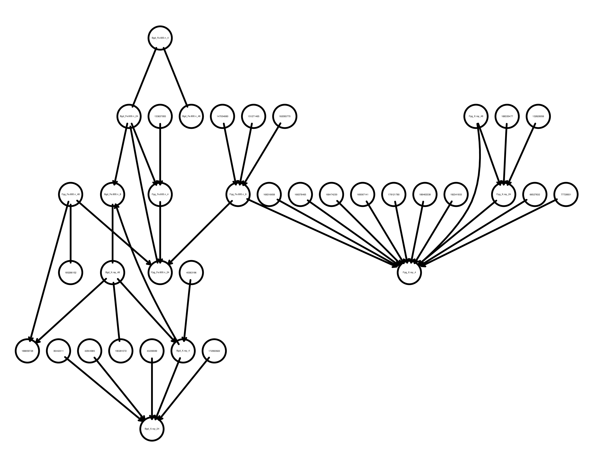

# DAG Validity For Astronaut Health

This project explores the application of Directed Acyclic Graphs (DAGs) within the Human System Risk Board (HSRB) framework to enhance astronaut mission outcomes. By constructing knowledge graphs for the 30 human system risks tracked by NASA, the HSRB aims to foster a shared understanding of causal relationships, improving insights and communication among stakeholders.

## Project Overview

This research applies DAGs to construct knowledge graphs for 30 human system risks tracked by NASA. The primary goal is to improve our understanding of causal relationships, ultimately enhancing astronaut mission outcomes.

## Research Question

Can Directed Acyclic Graphs (DAGs) be used to model complex relationships in astronaut mission outcomes based on observational data?

## Chosen Algorithm: PC

The PC (Peters & Clark) algorithm is a popular method for learning Bayesian network structures from observational data. It works by iteratively removing edges based on conditional independence tests. The main steps of the PC algorithm are as follows:

1. Start with a complete undirected graph.
2. Order the vertices.
3. For each pair of adjacent vertices:
   - Choose a conditioning set.
   - Test for conditional independence.
   - Remove the edge if the vertices are conditionally independent.

## Initial Research

We initially experimented with smaller datasets, each containing a limited number of variables and entries ([OSD-351](https://osdr.nasa.gov/bio/repo/data/studies/OSD-351), [OSD-477](https://osdr.nasa.gov/bio/repo/data/studies/OSD-477), [OSD-489](https://osdr.nasa.gov/bio/repo/data/studies/OSD-489), [OSD-608](https://osdr.nasa.gov/bio/repo/data/studies/OSD-608)). The objective was to capture basic causal relationships via DAGs, such as exposure to spaceflight causes a change in bone mass. However, due to the small sample sizes, the resulting relationships were often meaningless or poorly defined.

## Revised Approach

With the larger [OSD-366](https://osdr.nasa.gov/bio/repo/data/studies/OSD-366) dataset, we aimed to generate more meaningful DAGs. However, finding a definitive ground truth among such a large number of variables proved to be challenging. To address this, we revised our approach as follows:

- The dataset consists of primary fibroblast cells isolated from the ears of 76 mice across different strains.
- The focus is on comparing the effects of high Linear Energy Transfer (LET) radiation (Fe) and low LET radiation (X-ray).
- [Existing knowledge suggests that Fe ion radiation induces more clustered DNA damage compared to X-ray radiation.](https://doi.org/10.3390/ijms21186602)
- The generated DAG indicates that the nodes representing different types of radiation (Fe and X-ray) each point to a variety of different nodes, with each node representing a specific DNA location. The DAG suggests that Fe and X-ray radiation cause changes at these specific DNA locations. The hypothesis is that, if we measure the distances between all DNA locations connected to Fe radiation, we should observe smaller gaps, indicating more clustered damage. In contrast, measuring the distances between DNA locations connected to X-ray radiation should reveal larger gaps, reflecting more dispersed damage.

### Table 1: Top 5 Smallest Average Gaps (Base Pairs)

| Name                  | Average Gap |
|-----------------------|-------------|
| Fpg_X.ray_4 (200 samples)  | 55,981      |
| Fpg_Fe.600.n_24 (200 samples) | 63,652      |
| Fpg_Fe.600.n_8 (100 samples)  | 234,824     |
| Fpg_Fe.600.n_4 (300 samples)  | 685,386     |
| Bgd_Fe.600.n_8 (100 samples)  | 2,430,299   |

### Table 2: Top 5 Largest Average Gaps (Base Pairs)

| Name                   | Average Gap |
|------------------------|-------------|
| Bgd_X.ray_4 (100 samples) | 263,095,503 |
| Bgd_X.ray_24 (300 samples) | 67,767,664 |
| Fpg_X.ray_4 (300 samples)  | 59,571,718 |
| Fpg_X.ray_48 (300 samples) | 53,761,675 |
| Fpg_Fe.600.n_8 (300 samples) | 41,168,539 |

The tables above highlight the observed differences in DNA damage, with Fe radiation causing more clustered damage compared to X-ray radiation. This aligns with existing knowledge and suggests that the DAG generated is capturing meaningful causal relationships.

## Conclusion

This is the first promising result from our work. The DAG generated successfully illustrated that Fe-induced damage was more clustered than X-ray-induced damage, offering a potential starting point for understanding causal relationships in astronaut health risks. However, further research is needed to assess whether DAGs can be applied more broadly to model causal relationships in astronaut mission outcomes.

## Acknowledgments

Special thanks to UC Irvine, Nadia Ahmed, Lauren Sanders, Ryan Scott, Robert Reynolds, and Sylvain Costes for their contributions and support.
